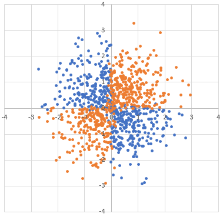

=============================================
Step-by-step Example: Solving the XOR Problem
=============================================

This tutorial introduces a basic and common usage of the primitiv by making and
training a simple network for a small classification problem.

Introduction: Problem Formulation
---------------------------------

Following lines are the formulation of the problem used in this tutorial:

.. math::

  \begin{array}{rrcl}
    f: & \mathbb{R}^2 & \rightarrow & [-1, 1]; \\
    f: & (x_1, x_2) & \mapsto & \left\{ \begin{array}{rl}
      1, & \mathrm{if} \ \ x_1 x_2 \geq 0, \\
      -1, & \mathrm{otherwise},
    \end{array} \right.
  \end{array}

where :math:`x_1, x_2 \in \mathbb{R}`.
This is known as the *XOR problem*; :math:`f` detects whether the signs of two
arguments are same or not.
We know that this problem is *linearly non-separatable*, i.e., the decision
boundary of :math:`f` can NOT be represented as a straight line on
:math:`\mathbb{R}`: :math:`\alpha x_1 + \beta x_2 + \gamma = 0`,
where :math:`\alpha, \beta, \gamma \in \mathbb{R}`.

For example, following code generates random data points
:math:`(x_1 + \epsilon_1, x_2 + \epsilon_2, f(x_1, x_2))` according to this
formulation with :math:`x_1, x_2 \sim \mathcal{N}(x; 0, \sigma_{\mathrm{data}})`
and :math:`\epsilon_1, \epsilon_2 \sim \mathcal{N}(\epsilon; 0, \sigma_{\mathrm{noise}})`:

.. code-block:: c++

  #include <random>
  #include <tuple>

  class DataSource {
    std::mt19937 rng;
    std::normal_distribution<float> data_dist, noise_dist;

  public:
    // Initializes the data provider with two SDs.
    DataSource(float data_sd, float noise_sd)
      : rng(std::random_device()())
      , data_dist(0, data_sd)
      , noise_dist(0, noise_sd) {}

    // Generates a data point
    std::tuple<float, float, float> operator()() {
      const float x1 = data_dist(rng);
      const float x2 = data_dist(rng);
      return std::make_tuple(
          x1 + noise_dist(rng),    // x1 + err
          x2 + noise_dist(rng),    // x2 + err
          x1 * x2 >= 0 ? 1 : -1);  // label
    }
  };

Following graph is an actual sample generated by above class with
``data_sd`` is :math:`1` and ``noise_sd`` is :math:`0.1`:

In this tutorial, we construct a 2-layers (input-hidden-output) perceptron to
solve this problem.
The whole model formulation is:

.. math::

  y := \tanh (W_{hy} \boldsymbol{h} + b_y),

  \boldsymbol{h} := \tanh (W_{xh} \boldsymbol{x} + \boldsymbol{b}_h),

where :math:`y \in \mathbb{R}` is an output value to be fit to :math:`f(x_1, x_2)`,
:math:`\boldsymbol{x} := (x_1 \ x_2)^{\top} \in \mathbb{R}^2` is an input vector,
:math:`\boldsymbol{h} \in \mathbb{R}^N` represents the :math:`N`-dimentional
*hidden state* of the network.
There are also 4 free parameters: 2 matrices :math:`W_{hy} \in \mathbb{R}^{1 \times N}`
and :math:`W_{xh} \in \mathbb{R}^{N \times 2}`, and 2 bias (column) vectors
:math:`b_y \in \mathbb{R}` and :math:`\boldsymbol{b}_h \in \mathbb{R}^N`.

Include and Initialization
--------------------------

primitiv requires you to include ``primitiv/primitiv.h`` before using any
features in the source code.
All features in primitiv is enabled by including this header
(available features are depending on specified
:doc:`options while building </reference/build_options>`).

``primitiv/primitiv.h`` basically may not affect the global namespace, and all
features in the library is declared in the ``primitiv`` namespace.
But for brevity, we will omit the ``primitiv`` namespace in this
tutorial using the ``using namespace`` directives.
Please pay attention to this point when you reuse these snippets.

.. code-block:: c++

  #include <iostream>
  #include <vector>
  #include <primitiv/primitiv.h>

  using namespace std;
  using namespace primitiv;

  int main() {

    // All code will be described here.
    
    return 0;
  }

Before making our network, we need to create at least two objects: ``Device``
and ``Graph``.
``Device`` objects specifies an actual computing backends (e.g., usual
CPUs, CUDA, etc.) and memory usages for these backends.
If you installed primitiv with no build options, you can initialize only
``primitiv::devices::Naive`` device object.
``Graph`` objects describe a temporary computation graph constructed by your
code and provides methods to manage their graphs.

.. code-block:: c++

  devices::Naive dev;
  Graph g;
  
  // "Eigen" device can be enabled when -DPRIMITIV_USE_EIGEN=ON
  //devices::Eigen dev;

  // "CUDA" device can be enabled when -DPRIMITIV_USE_CUDA=ON
  //devices::CUDA dev(gpu_id);

Note that ``Device`` and ``Graph`` is not a singleton; you can also create any
number of Device/Graph objects if necessary (even multiple devices share the
same backend).

After initializing a ``Device`` and a ``Graph``, we set them as the **default
device/graph** used in the library.

.. code-block:: c++

  Device::set_default(dev);
  Graph::set_default(g);

For now, it is enough to know that these are just techniques to reduce coding
efforts, and we don't touch the details of ths function.
For more details, please read the
:doc:`document about default objects </design/default_object>`.

Specifying Parameters and an Optimizer
--------------------------------------

Our network has 4 parameters described above:
:math:`W_{xh}`, :math:`\boldsymbol{b}_h`, :math:`W_{hy}` and :math:`b_y`.
We first specify these parameters as ``Parameter`` objects:

.. code-block:: c++

  constexpr unsigned N = 8;
  Parameter pw_xh({N, 2}, initializers::XavierUniform());
  Parameter pb_h({N}, initializers::Constant(0));
  Parameter pw_hy({1, N}, initializers::XavierUniform());
  Parameter pb_y({}, initializers::Constant(0));

``Parameter`` objects basically take two arguments: *shape* and *initializer*.
Shapes specify actual volume (and number of free variables) in the parameter,
and initializer gives initial values of their variables.
Above code uses the
`Xavier (Glorot) Initializer <http://proceedings.mlr.press/v9/glorot10a>`_
for matrices, and the constant :math:`0` for biases.

Next we initialize an ``Optimizer`` object and register all parameters to train
their values. We use simple SGD optimizer for now:

.. code-block:: c++

  constexpr float learning_rate = 0.1;
  optimizers::SGD opt(learning_rate);
  opt.add(pw_xh, pb_h, pw_hy, pb_y);

Writing the Network
-------------------

primitiv adopts the **define-by-run** style for writing neural networks.
Users can write their own networks as usual C++ functions.
Following code specifies the network described the above formulation using a
lambda functor which takes and returns ``Node`` objects:

.. code-block:: c++

  // 2-layers feedforward neural network
  // `x` should be with `Shape({2}, B)`
  auto feedforward = [&](const Node &x) {
    namespace F = primitiv::functions;
    const Node w_xh = F::parameter<Node>(pw_xh);       // Shape({N, 2})
    const Node b_h = F::parameter<Node>(pb_h);         // Shape({N})
    const Node w_hy = F::parameter<Node>(pw_hy);       // Shape({1, N})
    const Node b_y = F::parameter<Node>(pb_y);         // Shape({})
    const Node h = F::tanh(F::matmul(w_xh, x) + b_h);  // Shape({N}, B)
    return F::tanh(F::matmul(w_hy, h) + b_y);          // Shape({}, B)
  };

``Node`` objects represent an virtual results of network calculations which are
returned by functions declared in the ``primitiv::functions`` namespace and can
be used as an argument of their functions. Each ``Node`` has a *shape*, which
represents the volume and the size of the minibatch of the ``Node``.
primitiv encapsulates the treatment of minibatches according to the
:doc:`minibatch broadcasting rule </design/shape_and_minibatch>`,
and users can concentrate on writing the network structure without considering
actual minibatch sizes.

We also describe a loss function about our network:

.. code-block:: c++

  // Network for the squared loss function.
  // `y` is that of returned from `feedforward()`
  // `t` should be with `Shape({}, B)`
  auto squared_loss =  {
    namespace F = primitiv::functions;
    const Node diff = y - t;             // Shape({}, B)
    return F::batch::mean(diff * diff);  // Shape({})
  };

Also, we write the network to generate input data from above ``DataSource``
class:

.. code-block:: c++

  constexpr float data_sd = 1.0;
  constexpr float noise_sd = 0.1;
  DataSource data_source(data_sd, noise_sd);

  auto next_data = [&](unsigned minibatch_size) {
    std::vector<float> data;
    std::vector<float> labels;
    for (unsigned i = 0; i < minibatch_size; ++i) {
      float x1, x2, t;
      std::tie(x1, x2, t) = data_source();
      data.emplace_back(x1);
      data.emplace_back(x2);
      labels.emplace_back(t);
    }

    namespace F = primitiv::functions;
    return std::make_tuple(
        F::input<Node>(Shape({2}, minibatch_size), data),    // input data `x`
        F::input<Node>(Shape({}, minibatch_size), labels));  // label data `t`
  };

``primitiv::functions::input`` takes *shape* and actual data
(as a ``vector<float>``) to make a new ``Node`` object.
The order of data should be the **column-major order**, and the minibatch is
treated as the *last dimension* w.r.t. the actual data.
For example, the Node with  ``Shape({2, 2}, 3)`` has 12 values:

.. math::

  \left( \begin{array}{cc}
    a_1 & b_1 \\
    c_1 & d_1
  \end{array} \right),
  \left( \begin{array}{cc}
    a_2 & b_2 \\
    c_2 & d_2
  \end{array} \right),
  \left( \begin{array}{cc}
    a_3 & b_3 \\
    c_3 & d_3
  \end{array} \right)

and the actual data should be ordered as:

.. math::

  a_1, c_1, b_1, d_1, a_2, c_2, b_2, d_2, a_3, c_3, b_3, d_3.

Writing the Training Loop
-------------------------

Now we can perform actual training loop of our network:

.. code-block:: c++

  for (unsigned epoch = 0; epoch < 100; ++epoch) {
    // Initializes the computation graph
    g.clear();

    // Obtains the next data
    Node x, t;
    std::tie(x, t) = next_data(1000);

    // Calculates the network
    const Node y = feedforward(x);

    // Calculates the loss
    const Node loss = squared_loss(y, t);
    std::cout << epoch << ": train loss=" << loss.to_float() << std::endl;

    // Performs backpropagation and updates parameters
    opt.reset_gradients();
    loss.backward();
    opt.update();
  }

Above code uses ``Node.to_float()``, which returns an actual single value stored
in the ``Node`` (this function can be used only when the ``Node`` stores just
one value).

You may get following results by running whole code described above
(results may change randomly every time you launch the program):

.. code-block:: text

  0: loss=1.17221
  1: loss=1.07423
  2: loss=1.06282
  3: loss=1.04641
  4: loss=1.00851
  5: loss=1.01904
  6: loss=0.991312
  7: loss=0.983432
  8: loss=0.9697
  9: loss=0.97692
  ...

Testing
-------

Additionally, we launch a *test* process using a fixed data points in every 10
epochs:

* :math:`(1, 1) \mapsto 1`
* :math:`(-1, 1) \mapsto -1`
* :math:`(-1, -1) \mapsto 1`
* :math:`(1, -1) \mapsto -1`

.. code-block:: c++

  for (unsigned epoch = 0; epoch < 100; ++epoch) {
    //
    // Training process written in the previous code block
    //

    if (epoch % 10 == 9) {
      namespace F = primitiv::functions;
      const Node test_x = F::input<Node>(Shape({2}, 4), {1, 1, -1, 1, -1, -1, 1, -1});
      const Node test_t = F::input<Node>(Shape({}, 4), {1, -1, 1, -1});
      const Node test_y = feedforward(test_x);
      const Node test_loss = squared_loss(test_y, test_t);
      std::cout << "test results:";
      for (float val : test_y.to_vector()) {
        std::cout << ' ' << val;
      }
      std::cout << "\ntest loss: " << test_loss.to_float() << std::endl;
    }
  }

where ``Node.to_vector()`` returns all values stored in the ``Node``.

Finally, you may get like below:

.. code-block:: text

  ...
  8: loss=0.933427
  9: loss=0.927205
  test results: 0.04619 -0.119208 0.0893511 -0.149148
  test loss: 0.809695
  10: loss=0.916669
  11: loss=0.91744
  ...
  18: loss=0.849496
  19: loss=0.845048
  test results: 0.156536 -0.229959 0.171106 -0.221599
  test loss: 0.649342
  20: loss=0.839679
  21: loss=0.831217
  ...

We can see that the test results approaches correct values and the test loss
becomes small by proceeding the training process.
